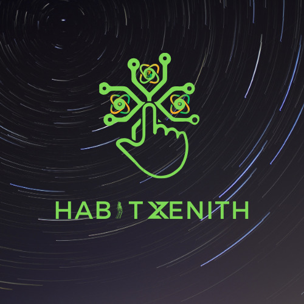

  

## Description

Habit Zenith is a habit tracking web application designed to help users build and maintain positive habits for personal development. Leverage AI insights and personalized support to make habit-building an engaging and rewarding experience.

---

## Features

- **Goal Setting:** Define and track your goals for personal improvement.
- **AI Insights:** Receive personalized tips and insights based on your habits and progress.
- **Gamified Challenges:** Engage in challenges to stay motivated and compete with friends.
- **User-Friendly Interface:** An intuitive and visually appealing interface for a seamless user experience.

---

## Tech Stack

- **Frontend:** HTML, CSS, JavaScript, ReactJS, Next.js
- **Backend:** Node.js, Express.js
- **Database:** MongoDB
- **AI Integration:** LLM
- **Deployment:** Vercel

---

## Getting Started

1. **Clone the repository:** `git clone https://github.com/koleajeolayinka/habit-zenith`
2. **Navigate to the project directory:** `cd habit-zenith`
3. **Install dependencies:** `npm install`
4. **Start the development server:** `npm run dev`

---

## Contributing

We welcome contributions from the community. If you'd like to contribute, please follow our [Contribution Guidelines](CONTRIBUTING.md).

---

## License

This project is licensed under the [MIT License](LICENSE).
